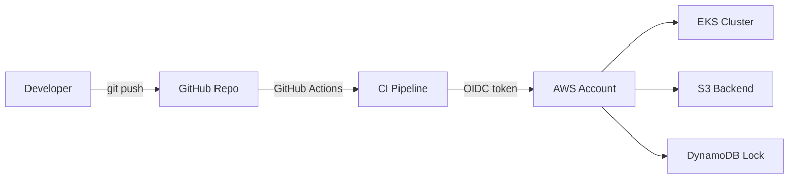
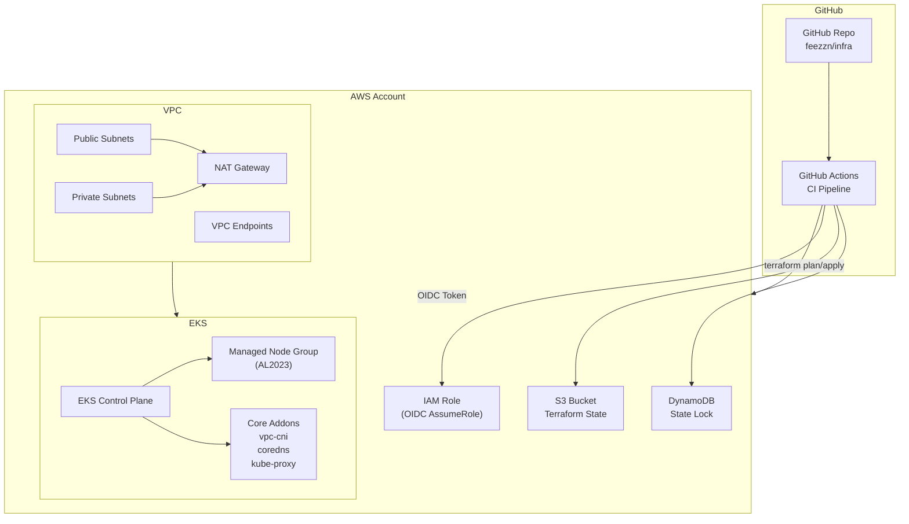

# ☁️ AWS Infrastructure — Terraform + EKS + GitHub OIDC

Provisionamento e operação de infraestrutura AWS com **Terraform**, seguindo práticas “enterprise”: **reprodutibilidade**, **segurança**, **CI/CD** e base pronta para **GitOps**.

---

## Overview

Este repositório cria uma infra AWS do zero, incluindo:
- **VPC** (subnets públicas/privadas, NAT Gateway, VPC Endpoints)
- **EKS** (managed node groups)
- **Terraform Remote State** (**S3 + DynamoDB**)
- **GitHub Actions com OIDC** (sem access keys long-lived)

**Repo:** `feezzn/infra` (branch `main`)  
**EKS (dev):** `us-east-2`  
**Terraform backend:** S3 `felipe-tfstate-660830512266-v2` + DynamoDB `terraform-locks-v2` em `us-east-1`

---

## Objectives

- Infra reprodutível via `terraform plan/apply`
- Separação clara de ambientes (**dev / prod / global**)
- CI seguro com **OIDC → STS AssumeRole**
- State remoto com **locking**
- Base Kubernetes pronta para **GitOps (Argo CD)**

---

## Architecture (C4)

### C4 — Level 1: System Context

### C4 — Level 2: Containers (Infrastructure View)

---

## 🗄️ 5. Terraform State & Backend

- 🪣 **S3** stores the Terraform state file
- 🔐 **DynamoDB** provides state locking (prevents concurrent applies)
- 🛠️ Backend resources are created via `bootstrap/backend`
- 🔒 State is encrypted and versioned

---

## 🔁 6. CI/CD — GitHub Actions

### 🔐 Authentication
- GitHub Actions authenticates to AWS using **OIDC**
- ❌ No access keys stored in GitHub or locally
- ⏱️ Temporary credentials via **AWS STS**

### ⚙️ Workflow Behavior
- `terraform fmt / validate / plan` on push
- **dev**: 🚀 automatic `plan + apply` on `main`
- **prod / global**: 🔒 apply requires manual approval (GitHub Environments)

---

## 🔐 7. Security Considerations

- ❌ No long-lived AWS credentials
- 🛡️ IAM roles scoped with **least privilege**
- 🔒 Remote state protected by locking
- ☸️ Kubernetes access managed via IAM + EKS access entries
- 🧩 Ready for **IRSA** and **GitOps** security patterns

---

## 🧑‍💻 8. How to Operate Locally

### 📋 Prerequisites
- Terraform
- AWS CLI
- kubectl

---

## 📊 9. Current State

- ☸️ **EKS cluster:** ACTIVE
- 📦 **Kubernetes version:** 1.34
- 🧱 **Node groups:** 1 (AL2023)
- ⚙️ **Core addons:** healthy
- ✅ **Terraform:** converged (no drift)

---

## 🚀 10. Next Steps

- ☸️ Install **Argo CD** (GitOps)
- 📦 Deploy sample application via GitOps
- 🔐 Harden EKS networking and endpoint access
- 📈 Introduce autoscaling strategy
- 🔄 Prepare upgrade path for Kubernetes versions

---

## 🔗 Related Repositories

- Infrastructure (Terraform): `myapp`
- Application (Helm chart): `infra-gitops`

---

## 👨‍💻 Author

Felipe  
☁️ Site Reliability / DevOps Engineer  
Focused on **secure**, **reproducible** and **operable** cloud infrastructure 🚀